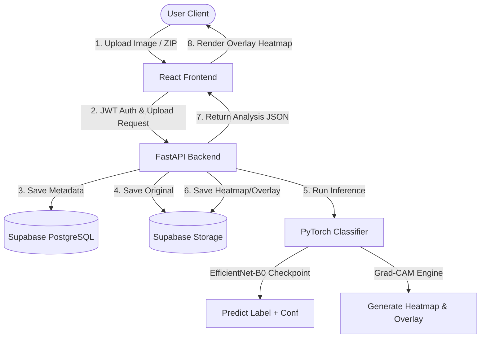
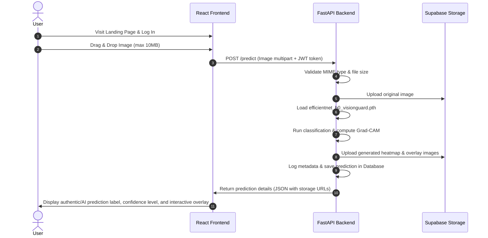
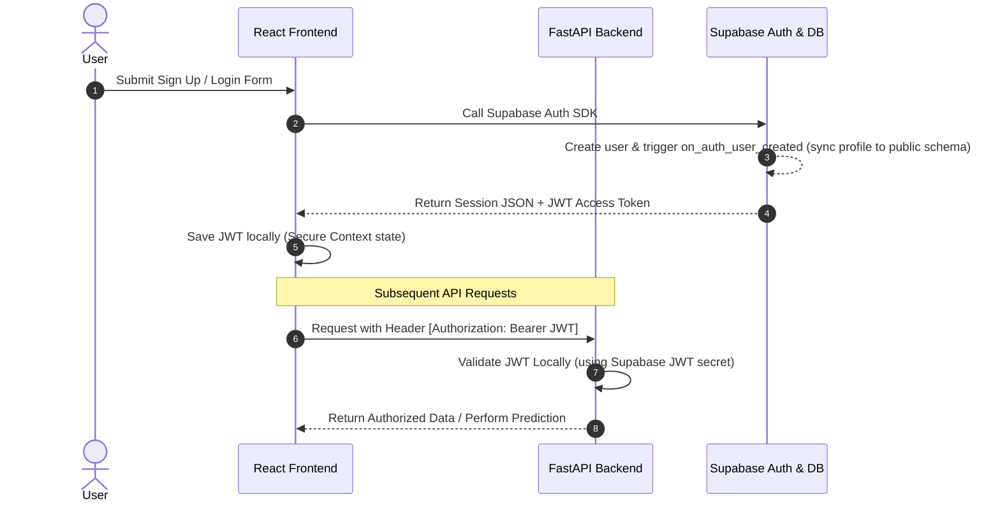

[](https://aravind-aariv-visionguardai.netlify.app)

# 🛡️ VisionGuard AI

### Explainable AI Deepfake & Image Authenticity Detection Platform

VisionGuard AI is a state-of-the-art Web & AI platform designed to detect deepfakes, manipulated content, and AI-generated imagery. Featuring an industry-grade **EfficientNet-B0** classifier (97.17% validation accuracy) coupled with **Grad-CAM (Gradient-weighted Class Activation Mapping)**, the platform not only predicts image authenticity but visually highlights the specific regions analyzed by the neural network to make its decision.

---

## 🚀 Key Features

*   **97.17% Accurate Classifier**: Trained custom EfficientNet-B0 binary model optimized for detecting structural patterns, noise discrepancies, and edge anomalies indicative of AI generation.
*   **Explainable AI (XAI)**: Generates high-fidelity Grad-CAM heatmap overlays mapping where the neural network focused its activation.
*   **Secure Authentication & RLS**: Secure signup, login, and profile syncing powered by Supabase Auth with strict Row Level Security (RLS) PostgreSQL database policies.
*   **Async Batch Processing**: Upload bulk images or complete ZIP archives to be processed asynchronously via background task worker queues.
*   **Interactive Analytics Dashboard**: Beautiful charts and telemetry displaying scan statistics, AI-to-Real distributions, and average inference latency.
*   **MNC-Grade System Design**: Fast, microsecond-latency FastAPI backend coupled with a modern React + Vite + Tailwind CSS landing client.

---

## ⚙️ How It Works (System Architecture)

VisionGuard AI connects a React frontend with a FastAPI backend and a Supabase PostgreSQL/Storage layer:



1.  **Input Processing**: An image is uploaded via the UI.
2.  **Inference Pipeline**: The FastAPI backend routes the image to the PyTorch inference service.
3.  **Explanation Generation**: Grad-CAM captures the activation patterns at the last convolutional block (`model.features[-1]`) of the EfficientNet-B0 network.
4.  **Heatmap Storage**: The generated heatmap and overlay images are pushed to Supabase storage buckets, and their public URLs are registered in the metadata tables.
5.  **Output**: The frontend renders the result overlay to let the user inspect the model's rationale.

---

## 🔄 User Flow



*   **Step 1 (Landing & Navigation)**: Guests can view the landing page and features, but scanning requires logging in.
*   **Step 2 (Image Submission)**: Users drag and drop or browse to select a PNG/JPG/WEBP image.
*   **Step 3 (Platform Processing)**: The loader is shown while backend services run inference.
*   **Step 4 (Results Visualizer)**: An interactive results card shows either `Real` (with green checkmark) or `AI Generated` (with warning badge), alongside the confidence percentage, processing latency, and the clickable toggle overlay mapping out suspicious regions.

---

## 🔐 Authentication Flow

VisionGuard AI integrates local verification with Supabase's identity provider for optimal performance and safety:



1.  **User Creation**: Signing up registers users in the Supabase `auth.users` schema. A PostgreSQL trigger automatically replicates basic profiles (`id`, `email`, `full_name`, `role = 'User'`) into the `public.users` table.
2.  **Session Retrieval**: Logins issue secure JWT access tokens to the frontend client.
3.  **Local Token Verification**: The FastAPI backend interceptor decodes and verifies incoming tokens against the repository's configured `JWT_SECRET` key, avoiding external API roundtrips.
4.  **Database RLS**: When writing or querying database entries, Supabase Postgres enforces Row Level Security based on the user's authenticated ID.

---

## 🛠️ Tech Stack & Structure

*   **Frontend**: React (v19), Vite, Tailwind CSS, Lucide icons.
*   **Backend**: FastAPI, Uvicorn, Pydantic, httpx.
*   **AI Engine**: PyTorch, Torchvision, OpenCV, NumPy, Pillow.
*   **Storage & Database**: Supabase Auth, Supabase Storage Buckets, Supabase PostgreSQL, RLS Policies.

### Repository Layout
```
├── ai_core/
│   ├── models/checkpoints/   # Trained EfficientNet-B0 model weights (.pth)
│   └── src/                  # Grad-CAM explanation utilities
├── backend/
│   ├── app/
│   │   ├── api/              # Route endpoints (predict, auth, admin, etc.)
│   │   ├── core/             # Application configs and security setups
│   │   ├── database/         # Supabase connection clients & sql migrations
│   │   ├── services/         # Prediction, storage, and telemetry routines
│   │   └── tests/            # API test suites (Pytest)
│   ├── static/               # Local fallback storage folders
│   ├── Dockerfile            # Container definition
│   └── requirements.txt      # Python dependencies
├── src/                      # Frontend components and layout structures
├── index.html                # Web entry point
├── package.json              # Node dependencies config
└── vite.config.js            # Frontend builder options
```

---

## 🚀 Getting Started

### 1. Prerequisites
*   Node.js (v18+)
*   Python (3.10+)

### 2. Backend Setup
1. Navigate to the backend directory:
   ```bash
   cd backend
   ```
2. Create and activate a virtual environment:
   ```bash
   python -m venv venv
   source venv/bin/activate  # On Windows: venv\Scripts\activate
   ```
3. Install dependencies:
   ```bash
   pip install -r requirements.txt
   ```
4. Copy the environment template and populate with your credentials:
   ```bash
   cp .env.example .env
   ```
5. Run the server:
   ```bash
   uvicorn app.main:app --reload
   ```

### 3. Frontend Setup
1. In the repository root directory, install npm packages:
   ```bash
   npm install
   ```
2. Launch the Vite development server:
   ```bash
   npm run dev
   ```
3. Open `http://localhost:5173` in your browser.

---

## 🧪 Testing

To run the automated backend test suites covering authentication, predictive queries, and dashboard metrics:
```bash
cd backend
python -m pytest
```